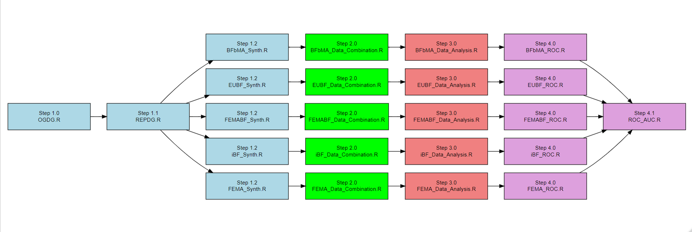

## Bayesian Hypothesis Testing for Direct Replication Studies

This project examines and compares Bayesian hypothesis testing methods, particularly within a meta-analytic framework. Motivated by the ongoing replication crisis in psychology, this work assesses how effectively Bayesian methods can distinguish between true and null effects in multi-lab replication projects.

### Objectives

- **Evaluate Bayesian Methods:** Examine four meta-analytic Bayesian methods (Meta-analytic Bayes Factors - MABFs) for determining replication success:
  - Evidence Updating Bayes Factor (EUBF)
  - Inclusion Bayes Factor (iBF)
  - Fixed-Effect Meta-Analytic Bayes Factor (FEMABF)
  - Bayes Factor based on Meta-Analysis (BFbMA)
- **Comparison with Frequentist Approach:** Compare performance against traditional fixed-effect meta-analysis (FEMA).

### Simulation Study

- **Design:** Two-phase simulation:
  - **Phase 1:** Generate original experimental results under varying effect sizes (0, 0.2, 0.5), sample sizes (20, 50, 200 per group), and research environments (no, medium, high publication bias/p-hacking).
  - **Phase 2:** Conduct direct replications (2, 5, 10 replications per study), varying sample sizes (40, 100, 400 per group), and apply Bayesian methods to replication results.

- **Total scenarios:** 243 unique scenarios, with 500 original studies per scenario, replicated 500 times, resulting in 60,750,000 observations.

- **Tools:** R version 4.3.1 on Texas A&M University's Terra and GRACE computing clusters.

### Repository Contents

We provide R scripts demonstrating simulation and data analysis procedures. Due to computational requirements, scripts from Steps 1.0 and 4.0 require high-performance computing resources. Fully processed simulation datasets are available for reviewers to reproduce results using the `Step 4.1 ROC_AUC.R` script.

**Step 1: Data Generation**
- Generate original (`Step 1.0 OGDG.R`) and replication study results (`Step 1.1 REPDG.R`).
- Synthesize replication data using Bayes factor methods:
  - `Step 1.2 BFbMA_SYNTH.R`
  - `Step 1.2 EUBF_SYNTH.R`
  - `Step 1.2 FEMABF_SYNTH.R`
  - `Step 1.2 iBF_SYNTH.R`
  - `Step 1.2 FEMA_SYNTH.R`

**Step 2: Data Combination**
- Combine synthesized replication data:
  - `Step 2.0 BFbMA_Data_Combination.R`
  - `Step 2.0 EUBF_Data_Combination.R`
  - `Step 2.0 FEMABF_Data_Combination.R`
  - `Step 2.0 iBF_Data_Combination.R`
  - `Step 2.0 FEMA_Data_Combination.R`

**Step 3: Data Analysis**
- Compute evaluation metrics (true/false positive and negative rates):
  - `Step 3.0 BFbMA_Data_Analysis.R`
  - `Step 3.0 EUBF_Data_Analysis.R`
  - `Step 3.0 FEMABF_Data_Analysis.R`
  - `Step 3.0 iBF_Data_Analysis.R`
  - `Step 3.0 FEMA_Data_Analysis.R`

**Step 4: ROC Curves Generation**
- Prepare data for ROC curves:
  - `Step 4.0 BFbMA_ROC.R`
  - `Step 4.0 EUBF_ROC.R`
  - `Step 4.0 FEMABF_ROC.R`
  - `Step 4.0 iBF_ROC.R`
  - `Step 4.0 FEMA_ROC.R`
- Generate ROC curves and compute AUC metrics (`Step 4.1 ROC_AUC.R`).

### Workflow Diagram

An R script workflow diagram is included to illustrate the data generation and analysis process.

